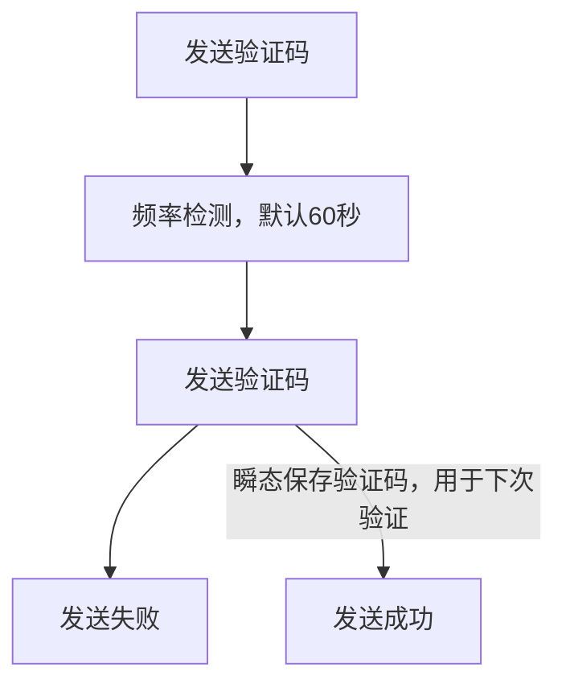
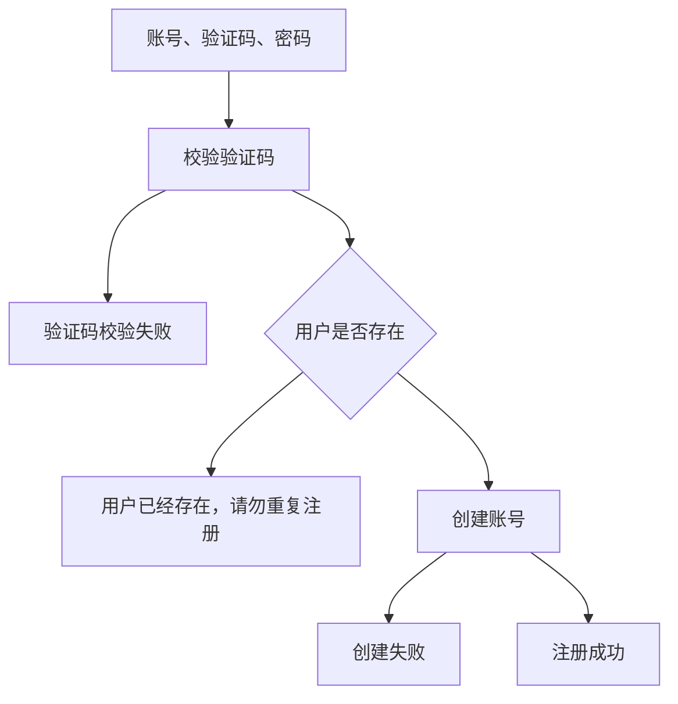
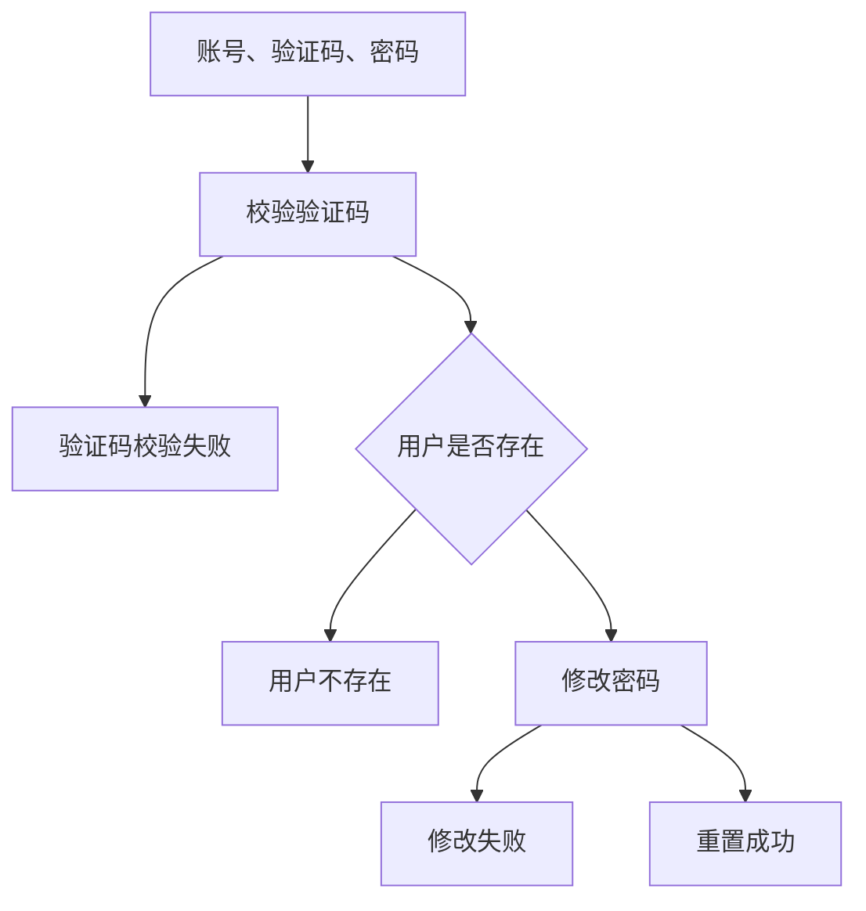
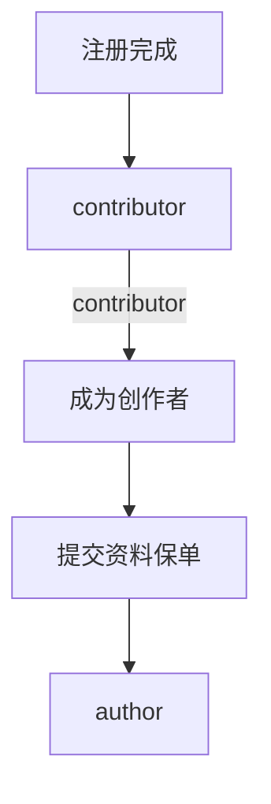
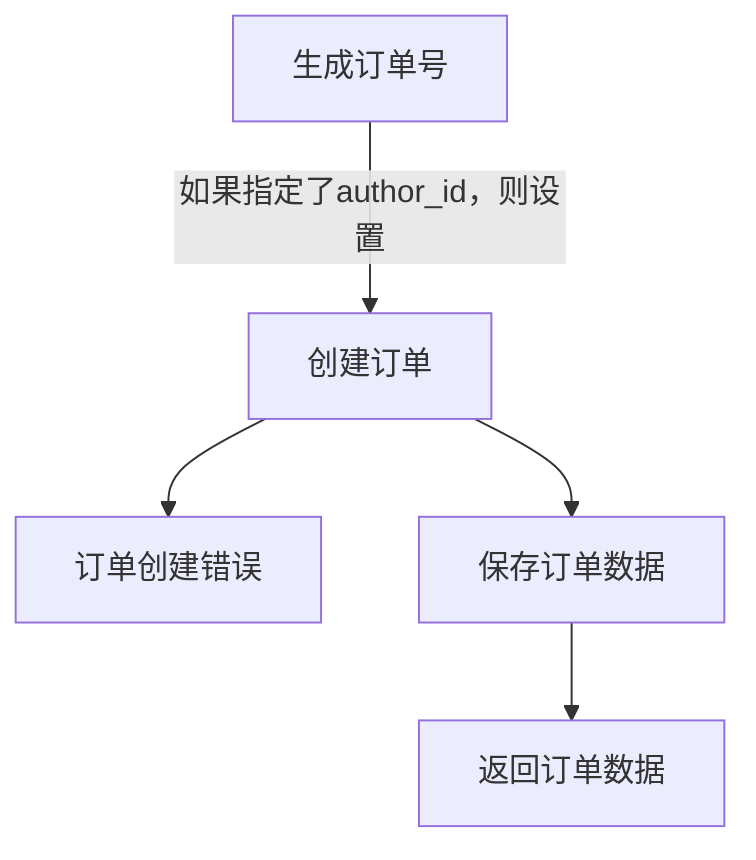
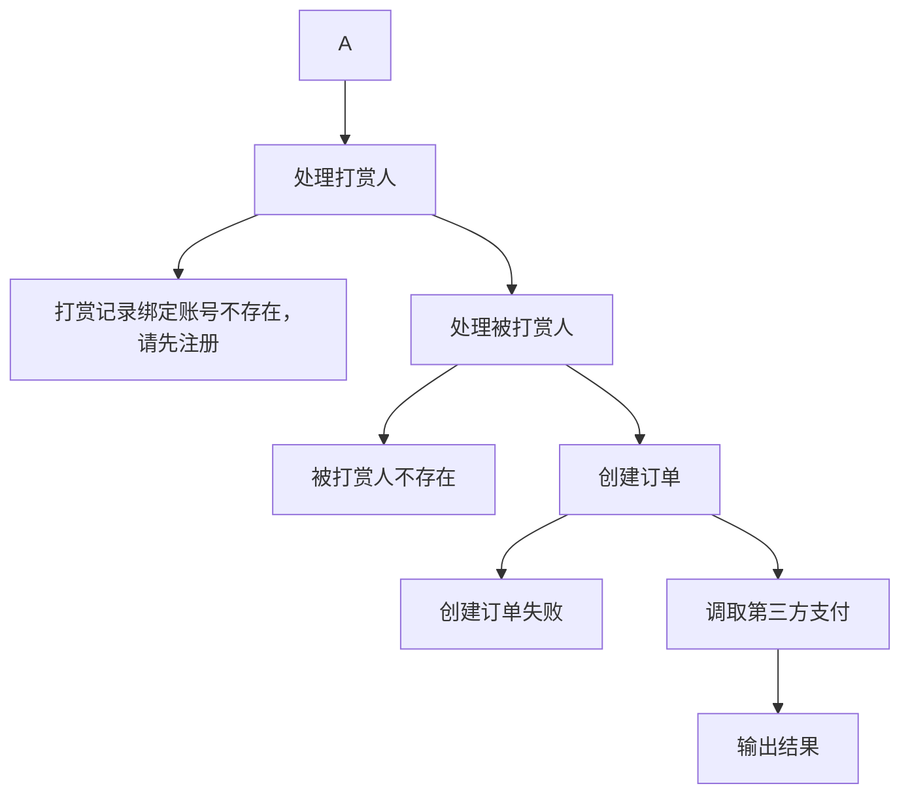
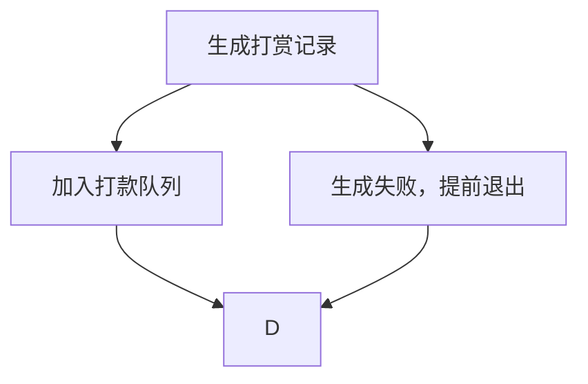
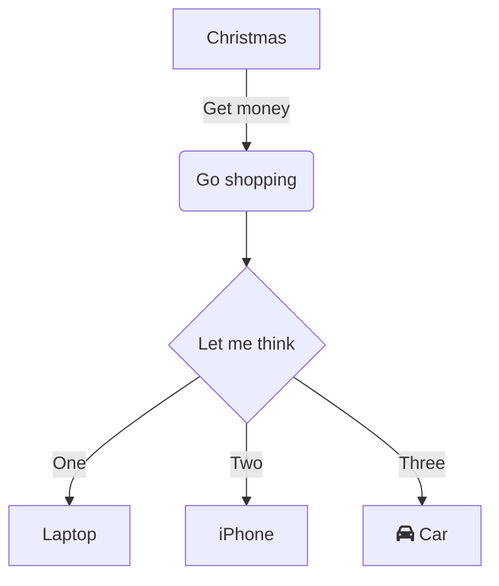

# 流程设计

## 验证码

```mermaid
graph TD
    A[发送验证码] --> B[频率检测，默认60秒]
    B --> C[发送验证码]
    C --> D[发送失败]
    C --> |瞬态保存验证码，用于下次验证| E[发送成功]
```

## 注册

```mermaid
graph TD
    A[账号、验证码、密码] --> B[校验验证码]
    B --> C[验证码校验失败]
    B --> D{用户是否存在}
    D --> E[用户已经存在，请勿重复注册]
    D --> F[创建账号]
    F --> G[创建失败]
    F --> H[注册成功]
```

## 忘记密码

```mermaid
graph TD
    A[账号、验证码、密码] --> B[校验验证码]
    B --> C[验证码校验失败]
    B --> D{用户是否存在}
    D --> E[用户不存在]
    D --> F[修改密码]
    F --> G[修改失败]
    F --> H[重置成功]
```

## 入驻

```mermaid
graph TD
    A[注册完成] --> B[contributor]
    B --> |contributor| C[成为创作者]
    C --> D[提交资料保单]
    D --> E[author]
```

## 创建订单

```mermaid
graph TD
    A[生成订单号] --> |如果指定了author_id，则设置| B[创建订单]
    B-->C[订单创建错误]
    B-->D[保存订单数据]
    D-->E[返回订单数据]
```

## 打赏

```mermaid
flowchart
  A --> B[处理打赏人]
  B --> C[打赏记录绑定账号不存在，请先注册]
  B --> D[处理被打赏人]
  D --> E[被打赏人不存在]
  D --> F[创建订单]
  F --> G[创建订单失败]
  F --> H[调取第三方支付]
  H --> I[输出结果]
```

## 支付

```mermaid
graph TD
    A[生成打赏记录] --> B[加入打款队列]
    A-->C[生成失败，提前退出]
    B-->D
    C-->D
```

```mermaid
flowchart TD
    A[Christmas] --> |Get money| B(Go shopping)
    B --> C{Let me think}
    C --> |One| D[Laptop]
    C --> |Two| E[iPhone]
    C --> |Three| F[fa:fa-car Car]
```
